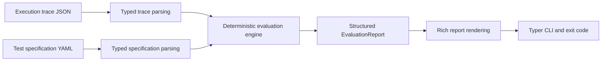

# AgentReplay

**Deterministic behavioral tests for AI agents.**

AI agents do not just generate text. They take actions.

AgentReplay lets developers assert what an agent actually did:

- which tools it called
- which tools it did not call
- in what order
- with what arguments
- how many times

Catch behavioral regressions before an agent reaches production.

AgentReplay does **not** judge natural-language quality. It deterministically evaluates
recorded agent actions from a JSON execution trace against a YAML test specification.

## Order Cancellation Example

The fictional order-management agent in [examples/order-agent](examples/order-agent) must
cancel order `12345` by calling `get_order`, then `check_cancellation_policy`, then
`cancel_order`. It must never call `issue_refund`, and it must not cancel the order twice.

```bash
agentreplay test examples/order-agent/success-trace.json \
	--spec examples/order-agent/cancel-order.yaml
```

```text
AgentReplay

Trace: order-agent-success
Specification: cancel-order

PASS get_order executed successfully
PASS check_cancellation_policy executed successfully
PASS cancel_order executed successfully
PASS check_cancellation_policy before cancel_order occurred in order
PASS issue_refund was not executed
PASS cancel_order executed at most 1 time(s)

6 passed
0 failed
```

The same directory also contains two regression traces:

| Trace | Expected result |
| --- | --- |
| [policy-violation-trace.json](examples/order-agent/policy-violation-trace.json) | Fails the ordering assertion because cancellation happens before the policy check. |
| [duplicate-cancellation-trace.json](examples/order-agent/duplicate-cancellation-trace.json) | Fails the execution-count assertion because `cancel_order` runs twice. |

## Installation

AgentReplay requires Python 3.14 or later. It is installed from source in this repository;
there is no PyPI release yet.

```bash
python -m pip install ".[dev]"
```

This installs the `agentreplay` command along with pytest and Ruff for local development.

## Quick Start

Run the passing order-cancellation example after installation:

```bash
agentreplay test examples/order-agent/success-trace.json \
	--spec examples/order-agent/cancel-order.yaml
```

AgentReplay parses the trace and specification, evaluates every configured rule, renders a
report, and returns a process exit code.

## Trace Format

An execution trace is a JSON document with schema version `"1"`, a run identifier, and an
ordered list of tool calls.

```json
{
	"schema_version": "1",
	"run_id": "order-agent-success",
	"tool_calls": [
		{
			"sequence_number": 1,
			"tool_name": "get_order",
			"arguments": {"order_id": "12345"},
			"execution_status": "succeeded"
		}
	]
}
```

`sequence_number` values must be contiguous and begin at `1`. Supported terminal statuses
are `succeeded`, `failed`, and `cancelled`. Tool arguments are JSON-compatible values.

## Specification Format

A behavioral test specification is a YAML document with schema version `"1"`, a name, and
one or more uniquely identified rules.

```yaml
schema_version: "1"
name: cancel-order
rules:
	- id: get-order-executed
		type: required_action
		tool_name: get_order

	- id: policy-before-cancellation
		type: action_ordering
		tool_names:
			- check_cancellation_policy
			- cancel_order

	- id: no-refund
		type: forbidden_action
		tool_name: issue_refund

	- id: cancel-once
		type: execution_count
		tool_name: cancel_order
		at_most: 1
```

See the complete [order cancellation specification](examples/order-agent/cancel-order.yaml)
for all six rules in the example.

## Supported Assertions

| Rule type | Behavior |
| --- | --- |
| `required_action` | Passes when the named tool has at least one successful invocation. |
| `forbidden_action` | Passes only when the named tool has no recorded invocation, regardless of status. |
| `action_ordering` | Requires successful actions to form the configured ordered subsequence. Repeated calls are allowed when a valid sequence exists. |
| `execution_count` | Counts all recorded invocations of a tool. Supports `exactly`, `at_least`, and `at_most`. |
| `argument_matching` | Passes when one invocation has an arguments object exactly equal to `expected_arguments`. Extra recorded arguments cause failure. |

Argument matching checks recorded arguments regardless of call status. Required and ordering
rules only treat successful calls as qualifying actions.

## CLI Usage

```text
agentreplay test TRACE_FILE --spec SPEC_FILE
```

For example:

```bash
agentreplay test examples/order-agent/success-trace.json \
	--spec examples/order-agent/cancel-order.yaml
```

Exit codes are intended for local automation and CI:

| Code | Meaning |
| --- | --- |
| `0` | All behavioral assertions passed. |
| `1` | One or more behavioral assertions failed. |
| `2` | Input was invalid, a file was missing, or an unexpected execution error occurred. |

Failure reports include the rule type, explanation, expected and observed values, and relevant
trace sequence numbers when available.

## CI Usage

This repository's [CI workflow](.github/workflows/ci.yml) installs the project, runs Ruff and
pytest, then executes the passing order-agent fixture. A behavioral failure returns exit code
`1`, which fails that workflow step.

Another repository can check out AgentReplay source and run its own trace/specification pair.
Replace `your-org/agentreplay` and `main` with a repository and revision your project trusts.

```yaml
name: Agent behavioral tests

on:
	pull_request:

jobs:
	agentreplay:
		runs-on: ubuntu-latest
		steps:
			- name: Check out application
				uses: actions/checkout@v4

			- name: Check out AgentReplay
				uses: actions/checkout@v4
				with:
					repository: your-org/agentreplay
					ref: main
					path: tools/agentreplay

			- name: Set up Python
				uses: actions/setup-python@v5
				with:
					python-version: "3.14"

			- name: Install AgentReplay
				run: python -m pip install ./tools/agentreplay

			- name: Verify recorded agent behavior
				run: >-
					agentreplay test tests/agent-traces/cancel-order.json
					--spec tests/agent-specifications/cancel-order.yaml
```

## Architecture



The CLI only orchestrates parsing, evaluation, rendering, and process exit. Parsing produces
Pydantic domain models; evaluators operate on those typed models; report rendering does not
decide pass or fail.

## Design Principles

- **Deterministic:** the same trace and specification always produce the same result.
- **Behavior-focused:** assertions concern recorded tool actions, not model prose.
- **Explicit:** invalid files raise input errors; failed assertions are structured report data.
- **Small surface area:** JSON traces, YAML specifications, five rule types, one CLI command.
- **CI-friendly:** readable terminal output and conventional process exit codes.

## Limitations

- AgentReplay does not evaluate natural-language responses, semantic quality, or user intent.
- It does not execute agents, call LLM providers, record traces, or integrate with agent frameworks.
- It accepts JSON execution traces and YAML specifications only.
- It does not provide a dashboard, persistence layer, hosted service, or PyPI distribution.

## Roadmap

Potential future work, not implemented today:

- additional trace adapters and recording integrations
- richer reporting formats
- a release and distribution workflow

## Contributing and Development

Install development dependencies, then run the same checks used in CI:

```bash
python -m pip install ".[dev]"
ruff check . && ruff format --check .
pytest
```

To manually verify the bundled passing behavior fixture:

```bash
agentreplay test examples/order-agent/success-trace.json \
	--spec examples/order-agent/cancel-order.yaml
```
